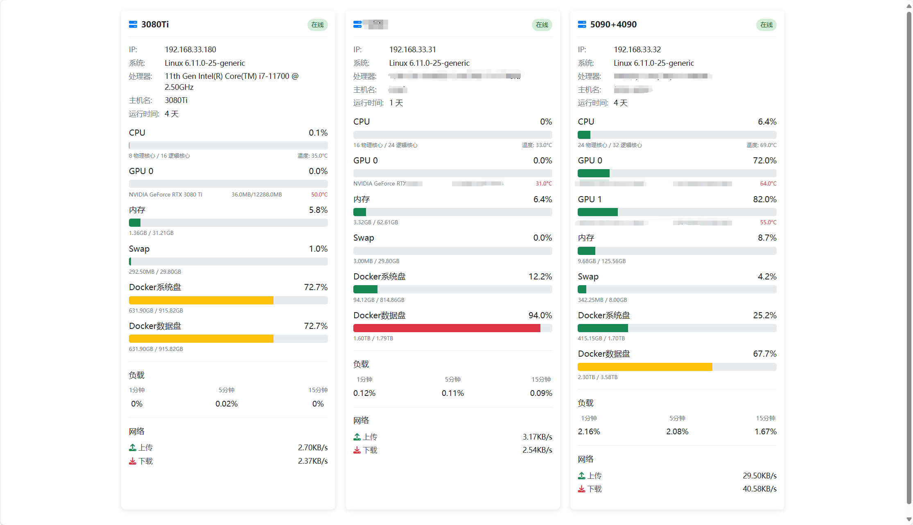

# 服务器集群监控面板

这是一个`cursor+claude-3.7-sonnet`写的基于Python+Flask的服务器监控系统，用于实时监控多台服务器的资源使用情况，包括CPU、内存、硬盘、网络、GPU等信息。



## 功能特点

- 使用Flask后端直接渲染网页界面
- 每个服务器在页面上以卡片形式显示
- 实时监控CPU、内存、交换分区、硬盘使用率
- 显示系统负载、网络速度和流量统计
- 支持GPU信息监控（如果服务器有GPU）
- 自动刷新功能，保持数据最新
- 支持同时监控多台服务器

## 系统要求

- Python 3.6+
- Flask 2.0+
- psutil 5.9.0+
- GPUtil 1.4.0+（可选，用于GPU监控）
- 现代Web浏览器（支持CSS Grid和Fetch API）

## 安装步骤

1. 克隆仓库或下载代码

2. 创建并激活虚拟环境（推荐）
   ```
   python -m venv venv
   source venv/bin/activate  # Linux/Mac
   ```

3. 安装依赖
   ```
   pip install -r requirements.txt
   ```

4. 运行服务器
   ```
   python app.py
   ```

5. 打开浏览器访问 http://localhost:60000

6. 开机自启动
   > 更改ExecStart中的环境路径和python文件路径
   - 主服务器

   ```Sh
   sudo tee /etc/systemd/system/server_monitor_panel.service <<EOF
   [Unit]
   Description=GPU Monitor Service
   After=network.target
   
   [Service]
   Type=simple
   ExecStart=/path/to/venv/bin/python /path/to/app.py
   Restart=always
   
   [Install]
   WantedBy=multi-user.target
   EOF
   sudo systemctl enable --now server_monitor_panel.service
   sudo systemctl restart server_monitor_panel.service
   ```
   
   - 节点服务器
   
   ```Sh
   sudo tee /etc/systemd/system/server_monitor_panel.service <<EOF
   [Unit]
   Description=GPU Monitor Service
   After=network.target
   
   [Service]
   Type=simple
   ExecStart=/path/to/venv/bin/python /path/to/server_monitor_node.py
   Restart=always
   
   [Install]
   WantedBy=multi-user.target
   EOF
   sudo systemctl enable --now server_monitor_panel.service
   sudo systemctl restart server_monitor_panel.service
   ```
   
   


## 部署多服务器监控

要监控多台服务器，您需要：

1. 在除了主服务器外的服务器上运行server_monitor_node.py
2. 在主服务器上修改app.py中的`node_list`添加以上服务器信息，并运行：
   ```python
   node_list =  [
           {'id': 1, 'name': '服务器A', 'ip': '192.168.1.100', 'port': 60000},
           # 添加更多服务器...
       ]
   ```

3. 确保所有服务器之间的网络连接正常，防火墙放行`60000`端口

## 配置说明

- 默认监听所有IP地址，端口60000
- 自动刷新间隔为1秒，可在`static/js/script.js`中修改
- 服务器列表位于`app.py`中的`main`函数

## 故障排除

- 如果无法获取远程服务器信息，请检查网络连接和防火墙设置
- 如果需要GPU监控，请确保已安装GPUtil库和NVIDIA驱动 
